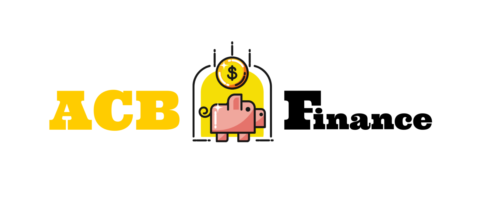

### Tópicos

- [Descrição do projeto](#descrição-do-projeto)

- [Funcionalidades](#funcionalidades)

- [Ferramentas utilizadas](#ferramentas-utilizadas)

## Descrição do projeto

Após alguns testes com protótipos feitos pelo time de UX de uma empresa, foi requisitada a primeira versão de uma aplicação para controle de orçamento familiar.
A aplicação deve permitir que uma pessoa cadastre suas receitas e despesas do mês, bem como gerar um relatório mensal.

### Tem como principais objetivos

1. Desenvolver uma API com rotas implementadas seguindo as boas práticas do modelo REST.
2. As validações devem ser feitas conforme as regras de negócio.
3. A implementação de base de dados visando persistência das informações.
4. Serviço de autenticação/autorização para restringir acesso às informações.

## Funcionalidades

:heavy_check_mark: `Funcionalidade 1:` Listagem de Receitas e de Despesas.

:heavy_check_mark: `Funcionalidade 2:` Cadastro de novas Receitas e de novas Despesas seguindo as validações conforme as regras de negócio.

:heavy_check_mark: `Funcionalidade 3:` Detalhamento de uma Receita ou Despesa com a sua ID

:heavy_check_mark: `Funcionalidade 4:` Atualização de Receitas e de Despesas seguindo as validações conforme as regras de negócio.

:heavy_check_mark: `Funcionalidade 5:` Exclusão de uma Receitas ou de Despesa.

## Ferramentas utilizadas

